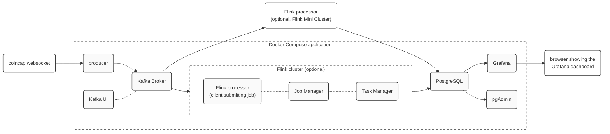

# Flink (Table API) + Kafka + PostgreSQL + Grafana Lab


## Overview

This lab showcases an end-to-end Docker Compose application combining Flink with Kafka, PostgreSQL and [Grafana](https://grafana.com/) to display real-time data about cryptocurrency exchanges.

The lab uses real-time data from [coincap](https://coincap.io/) about cryptocurrencies *FOREX trades*, i.e., transactions where a party buys or sells some number (*volume*) of *base* currency units, using some other *quote* currency to pay/being paid for the transaction. The combination *base / quote* is known as *currency pair*, which is the 'good' traded on FOREX exchange markets. The data is received through a websocket connection, one of the two freely available APIs provided by coincap ([documentation](https://docs.coincap.io/#ed9ed517-dd00-4d1d-98e4-772643117d9e)).

The following figure depicts the application architecture in terms of components (e.g., internal Docker containers), data flows (solid links) and other dependencies (dotted links):



Macro-components:
* *coincap websocket* - provides real-time data about cryptocurrency trades
* *Kafka producer* - custom Python Kafka producer that connects to the websocket and ingests trades into Kafka
* *Kafka + Kafka UI* (http://localhost:28080/) - stores trades under topic `trades` (retention 10'), decoupling their acquisition from their downstream processing
* *Flink processor* - reads trades from Kafka and computes open/min/max/close prices and buy/sell volumes for each time window of 1 minute. It runs in two ways:
  - as a self-contained (Flink Mini Cluster) application outside Docker, which is what you can use for developing the processor code
  - as a Flink cluster (http://localhost:8081/) inside Docker comprising three containers: Job Manager, Task Manager, and a Flink client that submits the processor job to the Job Manager
* *PostgreSQL + pgAdmin* (http://localhost:20080/) - stores time window data (prices and volumes) in two tables directly populated by Flink, with pgAdmin providing a web UI to browse DB content (may use `psql` as well)
* *Grafana* (http://localhost:23000/) - displays a dashboard with [candlesticks](https://en.wikipedia.org/wiki/Candlestick_chart) and volumes visualization for the data in PostgreSQL

Cryptocurrency trades obtained from *coincap* and injected into Kafka are JSON records like the following ones:
```json
{"exchange":"bitso","base":"terra-luna","quote":"euro","direction":"sell","price":80.17,"volume":2.76,"timestamp":1651687003450,"priceUsd":84.57143580503737}
{"exchange":"bitso","base":"xrp","quote":"tether","direction":"buy","price":0.6174,"volume":180,"timestamp":1651686997237,"priceUsd":0.6178606418423568}
{"exchange":"bitso","base":"safepal","quote":"tether","direction":"buy","price":0.6609,"volume":17,"timestamp":1651687003453,"priceUsd":0.661393097171386}
```

## How to Run and Develop

This is a Docker Compose application that involves building custom images for its Java/Python components (producer, processor). The default configuration does not enable the Docker containers for the Flink processor (`flink-jobmanager`, `flink-taskmanager`, `processor-java` or `processor-python`), as you don't need them while implementing the task of this lab that requires editing the processor code and run it from the IDE. If you want to enable them, e.g., to see the resulting application at work after you are finished writing the code, you need to edit `.env` and set `COMPOSE_PROFILES` to either `processor-python` (to run the Python version of the processor) or `processor-java` (to run the Java version).

Detailed instructions:

1. make sure you have both Docker and Java 11 installed (even if you work in Python; Java 17 may work too with this version of Flink)

2. clone this repository and copy `.env.example` into `.env`, possibly editing it (just creating `.env` is enough):
   ```bash
   $  git clone git@gitlab.inf.unibz.it:rtbdp/labs/lab_flink_crypto.git
   $  cd lab_flink_crypto
   $  cp .env.example .env
   ```

3. in a terminal, use Docker Compose to start or stop all the required components (by default, these do not include the processor)
   ```bash
   $  docker-compose up                        # to start the application
   $  docker-compose down -v --remove-orphans  # to stop the application, deleting all data and dangling containers (--remove-orphans)
   ```
   where `--remove-orphans` (optional) is useful to make sure that enabling/disabling the Flink containers does not result in some stopped Flink container remaining around.

   Once the application is started, the following web UIs can be accessed (default credentials are username=`user`, password=`user`):
   - Kafka UI: http://localhost:28080/
   - pgAdmin:  http://localhost:20080/
   - Grafana:  http://localhost:23000/
   - Flink UI: http://localhost:8081/  (only if the processor is running)

4. to develop in Python, you need to create a virtual environment and install dependencies
   ```
   $ cd processor-python
   $ python -m venv myenv
   $ source myenv/bin/activate
   $ pip install -U pip
   $ pip install -r requirements.txt
   ```
   then you can edit (and run when ready) file `processor-python/processor.py` (make sure `JAVA_HOME` is set and points to a Java 11 installation).

   To develop in Java, instead, open the Maven project under `processor-java` with your favorite IDE (e.g., IntelliJ IDEA), and then edit (and run when ready) class `it.unibz.inf.rtbdp.Processor`.

5. the supplied skeletons of class `Processor.java` and script `processor.py` only compute candlesticks from trades data, so if you run them only one panel will be populated in Grafana (class `ProcessorSolution.java` and `processor_solution.java` compute everything, but they represent the solutions of this lab so do not look at them right now, if available).

6. (optional, suggested once finishing implementing the processor) edit file .env enabling running the processor within Docker, by editing `.env` and setting `COMPOSE_PROFILES` to either `processor-python` or `processor-java`. This will enable additional Docker containers for Flink (`flink-jobmanager`, `flink-taskmanager`, `processor-java` or `processor-python`) which are disabled by default, as the recommended way to develop the processor is to run it outside Docker.

7. before starting developing, you may find interesting to run `producer/producer.py` to observe the stream of 'trade' events coming from the websocket in real time (press CTRL-C to terminate):
   ```bash
   $ cd producer
   $ # create a new virtual environment, or reuse the one of the processor
   $ # either way, you need to install the specific dependencies of the producer, i.e.:  pip install -r requirements.txt
   $ # then, make sure that JAVA_HOME points to a Java 8 to 11 JRE/JDK, e.g., by trying: echo $JAVA_HOME
   $ ./producer.py --url wss://ws.coincap.io/trades/gdax --dry-run --log-level debug
   ```
   which will result in an output like this:
   ```
   2024-05-07 11:56:28,988 (I) Writing data from 'wss://ws.coincap.io/trades/gemini' to Kafka topic 'trades' on 'localhost:29092' (dry-run) [MainThread]
   2024-05-07 11:56:29,212 (I) Websocket connected [MainThread]
   2024-05-07 11:56:33,425 (D) Received: {"exchange":"gemini","base":"ethereum","quote":"singapore-dollar","direction":"sell","price":4217.1,"volume":0.004686,"timestamp":1715075793000,"priceUsd":3116.3170838407605} [MainThread]
   2024-05-07 11:56:38,331 (D) Received: {"exchange":"gemini","base":"bitcoin","quote":"united-states-dollar","direction":"sell","price":64119.73,"volume":0.00031,"timestamp":1715075795000,"priceUsd":64119.73} [MainThread]
   2024-05-07 11:57:01,051 (D) Received: {"exchange":"gemini","base":"ethereum","quote":"united-states-dollar","direction":"buy","price":3112.63,"volume":0.064241,"timestamp":1715075819000,"priceUsd":3112.63} [MainThread]
   ...
   ^C
   2024-05-07 11:57:05,994 (I) WebSocket interrupted [MainThread]
   2024-05-07 11:57:06,157 (I) WebSocket disconnected [MainThread]
   2024-05-07 11:57:06,157 (I) tearing down on exception  [MainThread]
   2024-05-07 11:57:06,159 (I) Stopped [MainThread]
   ```
   Option `--dry-run` (here and in the processor) causes the output to be printed to stdout, instead of being emitted to the sink (resp. Kafka for the producer, PostgreSQL for the processor). Note that a dockerized version of `producer.py` runs as part of the Docker Compose application, so there is nothing else you have to do in order to ingest input data (unless you want to change the input feed, e.g., switching to a different exchange with faster or slower data rate, which you can do by editing property `EXCHANGE` to `.env`).

## What You Have to Do

For this lab setting you have two 'exercises':
1. ensure that this application runs properly on your machine (which means you need Docker, Docker Compose, Java and possibly Python properly set up)
2. develop a small extension of the processor, to compute volume data
3. optionally, run everything through Docker (after 1, better if done after having completed 2)

### Exercise #1

Follow instructions under 'How to run and develop', bullets 1 to 5, where in bullet 5 you try to run the supplied processor skeleton, either in Python or Java depending on the language you want to work with. This exercise is relevant as the Docker Compose application of this lab (as other end-to-end labs) is not very dissimilar from what you will be asked to deliver in your project. So if it runs on your machine, you have a good template for starting developing your project with Flink (for Spark, a similar lab is provided). If it doesn't run (esp. if you are on Windows or on Mac OS X with ARM cpu), please report the issue.

### Exercise #2

This is a small exercise that aims at making you more familiar with Flink, and in particular with its Table API / SQL support. You are advised to use such API for this exercise, but you may as well convert the input table coming from Kafka to a DataStream and work with the DataStream API, as you like (but be prepared to write much more code!).
Instructions:
* we are interested in computing, for each minute and for each *base currency / quote currency* pair from the input `trades` stream, the total volume (i.e., number of base currency units) *bought*/*sold*, as a further indication (besides the price movement shown via the candlesticks) of the market trend w.r.t. that currency pair. Intuitively:
  - for each traded pair, there's an *order book* with both *pending buy orders* with corresponding *bid* prices, and *pending sell orders* with corresponding *ask* prices, with *bid* prices < *ask* prices (the existence of orders is guaranteed by *market makers*, which make thus possible trades and profit from the ask-bid *spread*);
  - the *bought* volume is obtained by summing the `volume` field of trades with `direction="buy"` in CoinCap, i.e., trades where a buyer party placed a buy order with a bid price equal or higher than the price(s) of pending sell orders in the book;
  - the *sold* volume is obtained by summing the `volume` field of trades with `direction="sell"` in CoinCap, i.e., trades where a seller party placed a sell order with an ask price equal or lower than the price(s) of pending buy orders in the book;
  - intuitively, a higher `bought` volume should indicate higher 'pressure' from parties willing to buy the *base* currency of the traded pair, and thus likely correlate to an increase in time of that currency pair price. Similar intuition for `sold` volume and decrease of price (disclaimer: market behavior is surely more complex than that! this is just an exercise)
* so, basically, you are asked to implement a window computation where you group trades by *base / quote currency pair* and *start, end window boundaries*, and within each group (a window for that currency pair) you sum the `volume` of trades with `direction="buy"` as the `bought` volume, and you sum the `volume` of trades with `direction="sell"` as the `sold` volume
* computed data should populate an additional `volumes` table, whose definition you can find both in the Flink processor (you will 'insert' into that table) and in PostgreSQL (see file `postgres/init.slq`):
  ```sql
  CREATE TABLE volumes (
    ts_start TIMESTAMP(3) WITH TIME ZONE,
    ts_end TIMESTAMP(3) WITH TIME ZONE,
    currency_pair VARCHAR,
    volume_buy DOUBLE PRECISION,
    volume_sell DOUBLE PRECISION,
    PRIMARY KEY (ts_start, ts_end, currency_pair)
  );
  ```
* refer to Flink SQL documentation for writing [queries](https://nightlies.apache.org/flink/flink-docs-release-1.17/docs/dev/table/sql/queries/overview/) (look for 'grammar' inside the page, then expand that box) and for [functions](https://nightlies.apache.org/flink/flink-docs-release-1.17/docs/dev/table/functions/systemfunctions/); in particular, you may need to use *conditional functions* such as the one realized through the `CASE WHEN <condition> THEN <expression1> ELSE <expression2> END` SQL syntax (you can find it in the online documentation for functions).
* after you populate this table (your task), Grafana is already configured to read from it and you will see the 2nd and 3rd plots in the Grafana dashboard being populated as well.

### Exercise #3

Follow the instructions under 'How to run and develop', bullet 6. Concretely:
* ensure that the Docker application is not running - in case run `docker compose down -v` to stop it;
* edit file `.env`, setting `COMPOSE_PROFILES=processor-python` if you are working in python, or `COMPOSE_PROFILES=processor-java` if your language of choice is Java - this will enable the additional containers related to Flink;
* run again the Docker Compose application: `docker compose up`
  - this will generate the image for the processor of your choice
  - in case you want to change the processor afterwards, edit its file(s), then run `docker compose build` to recreate its image, followed by `docker compose down -v` (`-v` is optional, if you want to remove data as well to start from scratch) and finally `docker compose up`

## How It Works

### Using PostgreSQL in Docker

As for many other databases, when the PostgreSQL container is started the first time it will execute (in alphanumeric order) all the `.sql` and `.sh` scripts under `/docker-entrypoint-initdb.d`. A common pattern is therefore to mount a local directory with all the required initialization scripts on that container path, as we do in `docker-compose.yml` where directory `./postgres/` is mounted there. As a result, script `./postgres/init.sql` is executed when the container starts the first time, and its result is the creation of the necessary `candlesticks` and `volumes` tables that will be populated by the Flink processor. Also note that we are using PostgreSQL with the TimescaleDB extension for time series, which provide better performance in Grafana (not strictly needed).

### Using Grafana with PostgreSQL

We add the PostgreSQL database as a data source of Grafana, also supplying username and password to connect to it. When configuring the 'automated provisioning' of datasources and dashboards in Grafana (see README of [`lab_kafka_opensky`](https://gitlab.inf.unibz.it/rtbdp/labs/lab_kafka_opensky) for more information):
* we should place the password under `secureJsonData` in `grafana/datasources/all.yml`, otherwise it is not recognized and the dashboard will not be shown automatically (as we cannot connect to PostgreSQL)
* we should in general avoid to hard code credentials in `grafana/datasources/all.yml`, but rather use `${environment variables}` (see the file) that we can then inject from the outside via Docker Compose (i.e., via `.env`)

### Dockerizing Python/Java Applications

As for other labs, this lab provides an example of fully dockerized application, where all components can be run as Docker containers, including the custom Python/Java producer and processor we implement here. You may look at the respective `Dockerfile` for examples of how this is achieved.

An interesting aspect here concerns how to run Flink jobs in a fully dockerized setting. File `processor-python/Dockerfile` shows how to do that for Python:
* we start from our custom PyFlink image, so that we will ship both PyFlink and our Python code in a single image that can be used to run both (more convenient);
* the `CMD` directive uses the `flink` script already present in the image to submit the Python script as a job to a configurable Flink cluster. Note that in principle we might have run directly our Python script without submitting it to a cluster. This would remove the need for a `flink-jobmanager` and `flink-taskmanager` containers, but we will be constrained to use the Flink MiniCluster with its restrictions (e.g., cannot scale horizontally over multiple task managers).
File `processor-java/Dockerfile` shows the same for Java. The general structure of the Dockerfile, valid for any Maven application, is the one of a 2-phase Docker build, where first we start from the Maven image to compile the Java source code, and then we start from the target image (here, Flink one, but could have been the JDK one for a plain Java app) to create the resulting image.

You may use these `Dockerfile`(s) as templates for your project, if you are interested in delivering a project where *all* the involved components can be run via Docker Compose by simply running `docker-compose up` (possibly after setting up the configuration in `.env`).
