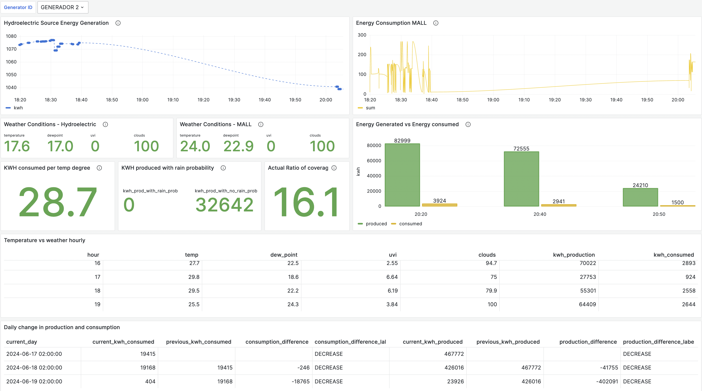
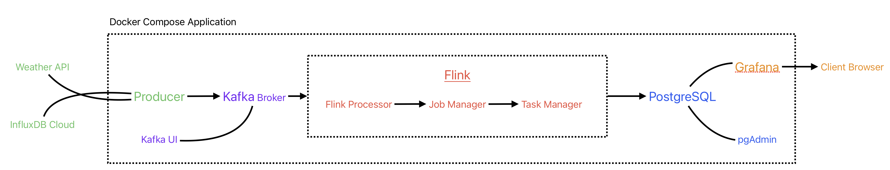

# Energy Weather Network Monitoring In Guatemala
### Weather API/InfluxDB + Kafka + Flink (Table API) + PostgreSQL + Grafana Lab



## Overview

This project aims to showcase an end-to-end Docker Compose application that uses tools like Flink, Kafka, PostgreSQL and Grafana to display real-time data about the consumption and generation of a small enlectric network in Guatemala.

This project uses real-time data from two main data sources, Weather data and energy consumption and generation from different sites in Guatemala. For the energy generation, the project focues specificly on the hydroelectric generation sector and how the weather conditions affect the energy generation. For the energy consumption, it focuses on the energy consumption of a mall. The energy sources are combined with the weather data that is obtained from the [OpenWeather API](https://openweathermap.org/api). 


The following figure depicts the application architecture in terms of components inside the main Docker application and external dependencies.




## How to Run and Develop


Detailed instructions:

1. make sure you have both Docker and Java 11 installed.

2. clone this repository 
  ```bash
  $  git clone https://github.com/Joancf1997/big_data_processing.git
  $  cd big_data_processing
  ```


3. copy `.env.example` into `.env`:
  ```bash
  $  cp .env.example .env
  ```

4. in a terminal, use Docker Compose to start or stop all the required components (by default, these do not include the processor)
  ```bash
  $  docker-compose up                        # to start the application.
  $  docker-compose down -v --remove-orphans  # to stop the application.
  ```

Once the application is started, the following web UIs can be accessed (default credentials are username=`user`, password=`user`):

- Kafka UI: http://localhost:28080/
- pgAdmin:  http://localhost:20080/
- Grafana:  http://localhost:23000/
- Flink UI: http://localhost:8081/ 

On the aplicaiton, the main components are the Grafana Dashboard were all the imoprtant insights are displayed, also all the data can be found on the postgreSQL database.